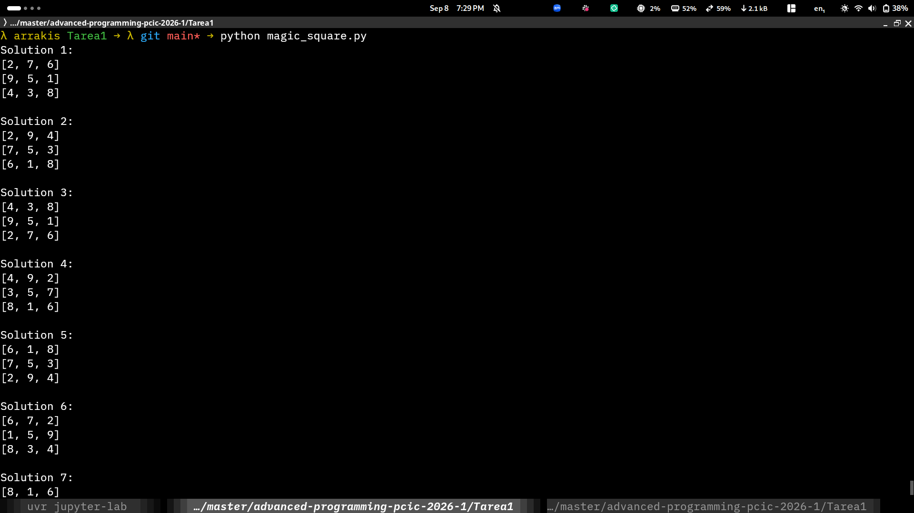

# Tarea 1: Cuadro mágicos

## Integrantes

- Abril Reyes Flores
- Diego Alberto Barriga Martínez

## Instalación

- Se requiere tener instalado `python>=3.10`

### Ejecución

``` shell
$ python magic_square.py
```

### Salida esperada

``` shell
Solution 1:
[2, 7, 6]
[9, 5, 1]
[4, 3, 8]

Solution 2:
[2, 9, 4]
[7, 5, 3]
[6, 1, 8]

Solution 3:
[4, 3, 8]
[9, 5, 1]
[2, 7, 6]

Solution 4:
[4, 9, 2]
[3, 5, 7]
[8, 1, 6]

Solution 5:
[6, 1, 8]
[7, 5, 3]
[2, 9, 4]

Solution 6:
[6, 7, 2]
[1, 5, 9]
[8, 3, 4]

Solution 7:
[8, 1, 6]
[3, 5, 7]
[4, 9, 2]

Solution 8:
[8, 3, 4]
[1, 5, 9]
[6, 7, 2]
```

### Capturas de pantalla


